# Capa

- **Título do Projeto**: A definir 
- **Nome do Estudante**: Alexandre Salgado  
- **Curso**: Engenharia de Software  
- **Data de Entrega**: 07/06/2025  

# Resumo

Este projeto visa desenvolver um software interativo para auxílio no aprendizado e prática de violão, com foco em reconhecimento de acordes em tempo real. O sistema será multiplataforma (desktop e mobile), desenvolvido em Flutter, e contará com um backend em Python para processar os áudios via inteligência artificial. O aplicativo oferecerá partitura interativa, metrônomo visual/sonoro, braço de violão com digitações corretas, e feedback instantâneo sobre a precisão da execução. Elementos de gamificação (níveis, XP, desafios diários) serão incluídos para tornar o aprendizado mais engajador.

## 1. Introdução

- **Contexto**: Aprender violão com precisão é um desafio comum para iniciantes. Ferramentas existentes oferecem suporte limitado em tempo real e pouca interatividade, o que compromete o progresso técnico de forma autônoma.

- **Justificativa**: A proposta preenche a lacuna por uma plataforma completa e interativa que ofereça feedback imediato, com funcionalidades didáticas integradas e recursos modernos de IA.

- **Objetivos**:
  - Desenvolver um software multiplataforma para prática de violão com feedback inteligente.
  - Implementar reconhecimento de acordes em tempo real com IA.
  - Integrar partitura interativa, braço de violão virtual e metrônomo visual/sonoro.
  - Estimular o engajamento com elementos de gamificação.

## 2. Descrição do Projeto

- **Tema do Projeto**: Tutor virtual de violão com IA para reconhecimento de acordes.
- **Problemas a Resolver**:
  - Falta de feedback interativo durante a prática.
  - Dificuldade em saber se o acorde está correto.
  - Falta de motivação e acompanhamento do progresso.

- **Limitações**:
  - Reconhecimento limitado a acordes comuns.
  - Sensível à qualidade do áudio.
  - Partitura inicial em formato simplificado.

- **Elementos de Gamificação**:
  - Sistema de níveis e XP.
  - Desafios diários.
  - Conquistas e emblemas.

## Especificação Técnica

### Tecnologias

- **Frontend**: Flutter (Dart) – multiplataforma
- **Backend**: Python com Flask
- **IA**: TensorFlow/Keras, Librosa
- **Comunicação**: HTTP/WebSockets
- **Audio**: Plugins Flutter (`record`, `audio_stream`)

### Algoritmos e Protocolos

- CNN-LSTM para reconhecimento de acordes
- Algoritmo de sincronização com metrônomo
- Suavização de saída do modelo para estabilidade

### Funcionalidades

- Captura e envio de áudio para backend
- Partitura interativa com rolagem
- Braço do violão com digitação e feedback
- Metrônomo visual/sonoro
- Feedback instantâneo
- Gamificação (XP, níveis, desafios, conquistas)

## Requisitos de Software

### Requisitos Funcionais (RF)

- RF01: Seleção de entrada de áudio
- RF02: Captura e envio de chunks de áudio
- RF03: Reconhecimento de acordes pelo backend
- RF04: Carregamento e exibição de partitura
- RF05: Feedback visual na partitura e braço do violão
- RF06: Configuração de BPM
- RF07: Feedback gamificado (XP, conquistas)
- RF08: Notificações de progresso e desafios

### Requisitos Não Funcionais (RNF)

- RNF01: Compatibilidade com Windows, Android e iOS
- RNF02: Latência de resposta inferior a 300ms
- RNF03: Precisão de reconhecimento superior a 85%
- RNF04: Interface intuitiva e responsiva
- RNF05: Suporte a variações de áudio e técnicas de toque

## Representação dos Requisitos

```mermaid
graph TD
    Usuario([Usuário])

    RF01[Selecionar fonte de áudio]
    RF02[Capturar e enviar áudio]
    RF03[Reconhecer acorde via backend]
    RF04[Carregar partitura]
    RF05[Exibir partitura interativa]
    RF06[Configurar BPM do metrônomo]
    RF07[Receber feedback visual e sonoro]
    RF08[Notificações de progresso e desafios]
    RF09[Exibir braço do violão e digitações]
    RF10[Receber XP e conquistas]

    Usuario --> RF01
    Usuario --> RF02
    Usuario --> RF03
    Usuario --> RF04
    Usuario --> RF05
    Usuario --> RF06
    Usuario --> RF07
    Usuario --> RF08
    Usuario --> RF09
    Usuario --> RF10

```

## Stack Tecnológica

### Linguagens

- Dart (frontend)
- Python (backend)

### Frameworks/Bibliotecas

- Flutter
- Flask
- TensorFlow/Keras
- Librosa
- NumPy

### Ferramentas

- VSCode
- GitHub
- Trello
- Figma

## Considerações de Segurança

- Comunicação segura via HTTPS
- Segurança na API Flask
- Termos de uso claros
- Robustez contra entradas inválidas

## Referências

- [Flutter](https://flutter.dev)
- [Dart](https://dart.dev)
- [Flask](https://flask.palletsprojects.com)
- [TensorFlow](https://www.tensorflow.org)
- [Librosa](https://librosa.org)
- [Songsterr](https://www.songsterr.com)
- [VSCode](https://code.visualstudio.com)
- [GitHub](https://github.com)
- [Trello](https://trello.com)

---

## Avaliações dos Professores

- Considerações Professor(a):
- Considerações Professor(a):
- Considerações Professor(a):
